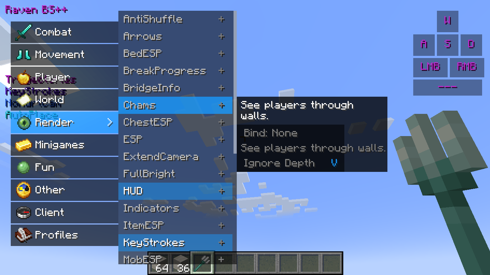

# RavenBS-Fabric (Minecraft 1.20.1)


[](LICENSE)
[](https://github.com/ByteFlipper-58/RavenBS-Fabric/releases/latest)
[](https://github.com/ByteFlipper-58/RavenBS-Fabric/stargazers)

## Description
**RavenBS-Fabric** is a powerful utility client for Minecraft 1.20.1 based on **Fabric Loader**. It is a complete port of the legendary [Raven bS++](https://github.com/OlziYT/RavenBS-Plus-Plus), retaining all original functionality while adding modern improvements, better performance, and full localization.

## Installation
1. Download and install **[Fabric Loader](https://fabricmc.net/)** for version 1.20.1.
2. (Recommended) Install **Fabric API**.
3. Download the latest `ravenbs-fabric-x.x.x.jar` from the [Releases](https://github.com/ByteFlipper-58/RavenBS-Fabric/releases) section.
4. Place the JAR file in your `.minecraft/mods` folder.
5. Launch Minecraft with Fabric.

## ⚙️ Configuration
RavenBS-Fabric uses a JSON-based configuration system.
*   **Config Location:** `.minecraft/keystrokesmod/profiles/`
*   **Default Profile:** `default`
*   **Load Config:** Use command `.config load <name>` (e.g. `.config load legit`)
*   **Share Configs:** Simply copy `.json` files to the profiles folder.

## 💻 Chat Commands

| Command | Description | Example |
| :--- | :--- | :--- |
| `.bind <module> <key>` | Bind a module to a key. | `.bind KillAura R` |
| `.toggle <module>` | Toggle a module. | `.toggle HUD` |
| `.friend add/remove <name>` | Add or remove a friend (KillAura ignores friends). | `.friend add Alex` |
| `.friend list` | Show your friends list. | `.friend list` |
| `.config save/load <name>` | Save or load a config profile. | `.config save legit` |
| `.config list` | List available profiles. | `.config list` |
| `.updatecheck on/off/status` | Enable/disable or check the update checker. | `.updatecheck status` |
| `.help` | Show all commands. | `.help` |

You can disable the update checker at any time with `.updatecheck off` and re-enable it with `.updatecheck on`.

## Development

### Prerequisites
- [JDK 21 LTS](https://adoptium.net/temurin/releases/?version=21) (for compilation)
- [Gradle](https://gradle.org/install/) (latest version)

### Building the project
```bash
# Clone the repository
git clone https://github.com/ByteFlipper-58/RavenBS-Fabric.git   
cd RavenBS-Fabric

# Build the project
./gradlew build --no-daemon
```

The compiled JAR files will be available in the `build/libs/` folder.

### IDE Setup
The project uses Gradle to manage dependencies and configuration. You can import the project into IntelliJ IDEA or Eclipse.

## Contributing
1. Fork the project
2. Create a feature branch (`git checkout -b feature/amazing-feature`)
3. Commit your changes (`git commit -m 'Add some amazing feature'`)
4. Push to the branch (`git push origin feature/amazing-feature`)
5. Open a Pull Request

## Versioning
We use [semantic versioning](https://semver.org/). For available versions, see the [tags on this repository](https://github.com/ByteFlipper-58/RavenBS-Fabric/tags).

## Credits
*   **[ByteFlipper](https://github.com/ByteFlipper-58)** - *Main Developer / Fabric Port*
*   **[OlziYT](https://github.com/OlziYT)** - *Original [Raven bS++](https://github.com/OlziYT/RavenBS-Plus-Plus) Developer*
*   **Raven b+ Team** - *Original Base Client*

## License
This project is licensed under the GNU General Public License v3.0 (GPLv3).
Copyright (c) 2026 ByteFlipper.
See the [LICENSE](LICENSE) file for details.
